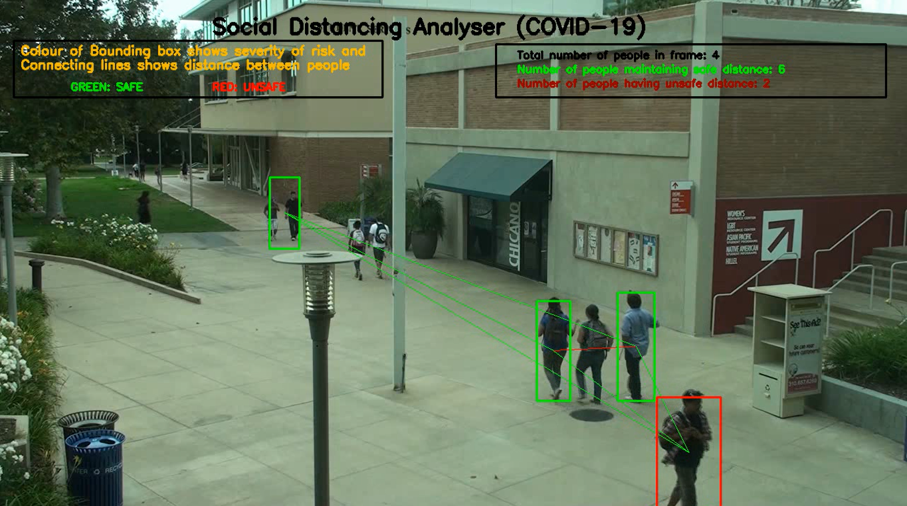

# SocialDistanceAnalyzer
[COVID-19] Social Distance Analyzer model

The best thing we can do to be safe in current situation is by social distancing. 

The project uses Tiny Yolo object detection model. The distance between people in the frame is calculated using Euclidean distance.

Tiny YOLO model and weights can be downloaded here: https://github.com/qqwweee/keras-yolo3

# Output

# To use

Clone the repository using command: git clone https://github.com/PreetiSajjan/SocialDistanceAnalyzer.git

The dataset used is included in the repository so need not to be downloaded explicitly.

Run the command python VideoReader.py to run the model.

# Contribution and References

Inspiration for this project is Prof. Andrew Ng's post on Social Distance Analysis https://www.technologyreview.com/2020/04/17/1000092/ai-machine-learning-watches-social-distancing-at-work/

Feel free to contribute to the project.

** Kindly cite if any part of the code is referred. **
